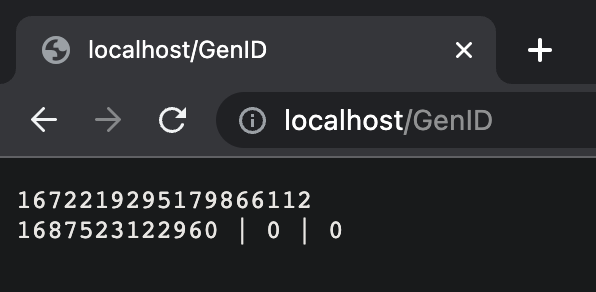

# OnlyID

[简体中文](./docs/README_cn.md)

[English](./README.md)

This is a simple implementation of the most famous unique ID generation algorithm Twitter snowflake

## Design

```
+--------------------------------------------------------------------------+
| 1 Bit Unused | 41 Bit Timestamp |  10 Bit NodeID  |   12 Bit Sequence ID |
+--------------------------------------------------------------------------+
```

## Usage

```golang
host, err := snowflake.NewHost(/* Your host's node id */)
// Error handling ...
id := host.Generate()
```

## Example

You can see an example by the following steps.

### Build

```golang
go build
./onlyID
```

### Launch

Access via a browser like Google Chrome

```
http://localhost/GenID
```



- the first line is the generated id
- the second line includes Timestamp, NodeID, SequenceID, respectively.

## Advance

- You should implement this algorithm inside your server. (for example: an ID generation server)
- Check out the `docker` folder, use Docker to build a image for your IDGenServer.
- Deploy a distributed system with the image you have built.

## Reference

[Snowflake](https://github.com/bwmarrin/snowflake)
