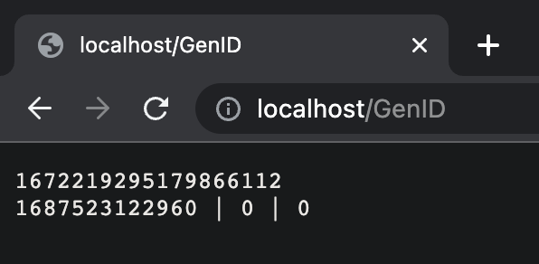

# OnlyID

[简体中文](./README_cn.md)

[English](../README.md)

OnlyID 是对 Twitter 的著名唯一 ID 生成算法 Snowflake 的一种实现。

## ID 设计

```
+--------------------------------------------------------------------------+
| 1 Bit 未使用 | 41 Bit 时间戳 |  10 Bit 机器节点 ID  |   12 Bit 序列 ID |
+--------------------------------------------------------------------------+
```

## 用法

```golang
host, err := snowflake.NewHost(/* 你的主机的节点 ID */)
// 错误处理 ...
id := host.Generate()
```

## 例子

按照下面的步骤可以快速上手一个例子

### 构建

```golang
go build
./onlyID
```

### 运行

使用 Google Chorme 等浏览器访问

```
http://localhost/GenID
```



- 第一行是生成的唯一 ID
- 第二行每一部份包含：时间戳、节点ID、还有序列ID

## 高级

- 你应该在你自己的服务器上部署这个算法（例如：一个 ID 生成服务）
- 在 `docker` 目录里面可以找到构建 Docker 镜像需要的资源，为你的 IDGen 服务器构建一个镜像资源。
- 将镜像部署到一个分布式系统中。

## 参考

[Snowflake](https://github.com/bwmarrin/snowflake)
